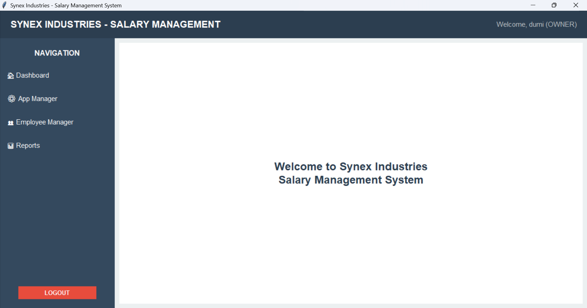

# 💼 Synex Industries - Salary Management System

[](https://www.python.org/)
[](https://www.mysql.com/)
[]()
[](LICENSE)

> A complete **Salary Management System** built with **Python (CLI + Tkinter GUI)** and **MySQL** for professional use at Synex Industries. From secure login and employee handling to tax computation, reporting, and salary analytics — it's all here.

## 📌 The project includes both:
- A **CLI version** (developed in 2022)
- An improved and feature-rich **GUI version** (completed in 2025)
---

## 📚 Table of Contents

- [🌟 GUI Highlights](#-gui-highlights)
- [🚀 Features](#-features)
- [🛠️ Tech Stack](#️-tech-stack)
- [📁 Project Structure](#-project-structure)
- [🖼️ Screenshots](#-screenshots)
- [🎥 Demo Videos](#-demo-videos)
- [🔧 Setup Instructions](#-setup-instructions)
- [📌 Future Improvements](#-future-improvements)
- [🙋‍♂️ Author](#-author)

---

## 🌟 GUI Highlights

The 2025 **Tkinter GUI version** brings a modern, intuitive interface to manage the entire salary process:

- 💻 Multi-role login system with secure password authentication  
- 📊 Real-time salary sheet generation, tax analysis, and profit reports  
- 🗂️ Integrated file viewer for browsing reports  
- ⚙️ Owner dashboard for managing users, professions, and configurations  

**Roles:**
- **Owner:** Full access (manage users, employees, system settings)  
- **Admin:** Employee & salary management  
- **User:** Profile view and personal salary info  - Devoloping 

---

## 🚀 Features

- User Authentication (Owner / Admin / User)
- Profession & Daily Rate Management
- Employee Attendance & Work Tracking
- Salary Sheet Generation
- Monthly Tax Calculation
- Company Profit Analysis
- Yearly and Monthly Salary Reports
- File Manager + Report Viewer
- CLI and GUI Versions Included

---

## 🛠️ Tech Stack

| Layer         | Technology          |
|---------------|---------------------|
| Language      | Python 3.x          |
| GUI Framework | Tkinter             |
| Database      | MySQL               |
| File I/O      | CSV / TXT           |
| Reporting     | Custom Python Logic |
| Connector     | mysql-connector-python |

---

## 📁 Project Structure

```

synex\_salary\_management\_system/
├── gui\_version/
│   └── main\_gui.py
├── cli\_version/
│   └── main.py
├── assets/
│   ├── database/
│   │   └── salary\_system.sql
│   ├── screenshots/
│   └── videos/
├── data/
├── requirements.txt
└── README.md

````

> 📂 **Database file** is available inside: `assets/database/salary_system.sql`

---

## 🖼️ Screenshots

### 🔹 GUI Dashboard  


### 🔹 CLI Login  


---

## 🎥 Demo Videos

- 🎬 [GUI Version Demo](assets/videos/gui_demo.mp4)
- 🎬 [CLI Version Demo](assets/videos/cli_demo.mp4)

> Tip: Upload large videos to YouTube and embed or link them here.

---

## 🔧 Setup Instructions

### 1️⃣ Requirements

```bash
pip install -r requirements.txt
````

> `tkinter` is included by default in Python.
> MySQL must be installed and running.

### 2️⃣ Import Database

Import the provided SQL file into your MySQL server:

```
assets/database/salary_system.sql
```

### 3️⃣ Run GUI Version

```bash
cd gui_version
python main_gui.py
```

### 4️⃣ Run CLI Version

```bash
cd cli_version
python main.py
```

---

## 📌 Future Improvements

* PDF report export
* Cloud database support
* Dark mode & UI themes
* Email notifications for employees

---

## 🙋‍♂️ Author

Made with ❤️ by [**codedbydumi**](https://github.com/codedbydumi)

```

---

Let me know if you'd like:
- A matching `LICENSE` file (MIT, Apache, etc.)
- Auto-generated badges for GitHub Actions or dependencies
- Help adding a `requirements.txt` file

You're almost ready for GitHub discovery. 🚀
```
