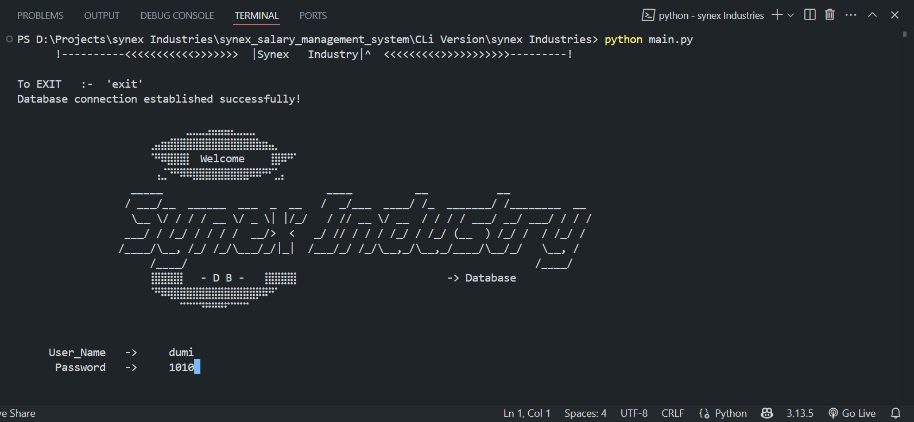

```markdown
# 💼 Synex Industries - Salary Management System

[](https://www.python.org/)
[](https://www.mysql.com/)
[]()
[](LICENSE)

> A complete **Salary Management System** built with **Python (CLI + Tkinter GUI)** and **MySQL** for professional use at Synex Industries. From secure login and employee handling to tax computation, reporting, and salary analytics — it's all here.

---

## 📚 Table of Contents

- [🌟 GUI Highlights](#-gui-highlights)
- [🚀 Features](#-features)
- [🛠️ Tech Stack](#️-tech-stack)
- [📁 Project Structure](#-project-structure)
- [🖼️ Screenshots](#-screenshots)
- [🎥 Demo Videos](#-demo-videos)
- [🔧 Setup Instructions](#-setup-instructions)
- [📌 Future Improvements](#-future-improvements)
- [📄 License](#-license)
- [🙋‍♂️ Author](#-author)

---

## 🌟 GUI Highlights

The 2025 **Tkinter GUI version** brings a modern, intuitive interface to manage the entire salary process:

- 💻 Multi-role login system with secure password authentication
- 📊 Real-time salary sheet generation, tax analysis, and profit reports
- 🗂️ Integrated file viewer for browsing reports
- ⚙️ Owner dashboard for managing users, professions, and configurations

> 🎯 GUI roles:
> - **Owner**: Full access (manage users, employees, settings)
> - **Admin**: Employee & salary management
> - **User**: Personal profile and salary access

---

## 🚀 Features

- **User Login & Role Permissions**
- **Profession & Daily Rate Management**
- **Employee Work Tracking**
- **Salary Sheet Generation**
- **Tax Deduction & Profit Calculation**
- **Monthly & Yearly Reports**
- **Report Viewer + File Manager**
- **CLI & GUI Versions Included**

---

## 🛠️ Tech Stack

| Layer         | Tech               |
|---------------|--------------------|
| Language      | Python 3.x         |
| GUI Framework | Tkinter            |
| Backend DB    | MySQL              |
| Storage       | Text/CSV Files     |
| Reporting     | Custom Logic       |
| Packaging     | MySQL Connector, OS, CSV, etc. |

---

## 📁 Project Structure

```

salary-management-system/
├── cli\_version/              # Console-based version (2022)
├── gui\_version/              # GUI version using Tkinter (2025)
├── assets/
│   ├── screenshots/          # GUI/CLI screenshots
│   ├── videos/               # Project demo videos
│   └── database/             # MySQL DB dump (.sql)
├── data/                     # Salary sheets, logs, outputs
├── requirements.txt          # Python dependencies
├── LICENSE
└── README.md

````

> 📌 **Note**: You’ll find the MySQL database schema inside `assets/database/salary_system.sql`

---

## 🖼️ Screenshots

### 🔹 GUI Dashboard  


### 🔹 CLI Login  


---

## 🎥 Demo Videos

- 🔹 [CLI Version Demo](assets/videos/cli_demo.mp4)
- 🔹 [GUI Version Demo](assets/videos/gui_demo.mp4)

*(For GitHub size limits, upload larger videos to YouTube and link here.)*

---

## 🔧 Setup Instructions

### 📦 Prerequisites

- Python 3.10+
- MySQL Server
- Python packages:
  ```bash
  pip install -r requirements.txt
````

### 🗄️ Database Setup

1. Start your MySQL server
2. Import the schema file:

   ```
   assets/database/salary_system.sql
   ```

### ▶️ Run GUI Version

```bash
cd gui_version
python main_gui.py
```

### ▶️ Run CLI Version

```bash
cd cli_version
python main.py
```

---

## 📌 Future Improvements

* 📤 Export reports as PDFs
* 🌐 Cloud-hosted database support
* 🌙 Dark mode + theming
* 📧 Email notifications for payslips

---

## 📄 License

This project is licensed under the [MIT License](LICENSE).

---

## 🙋‍♂️ Author

Made with ❤️ by [**codedbydumi**](https://github.com/codedbydumi)

---

```

---

## ✅ Bonus: Add `requirements.txt`

Here’s a simple `requirements.txt` example if you haven’t created one yet:

```

mysql-connector-python

```

> *Note: `tkinter` comes with Python, so no need to include it in `requirements.txt`.*

---

Would you like me to:
- Convert this into a downloadable `.md` file?
- Help with generating `LICENSE` or GitHub release notes?
- Suggest a good cover banner or preview image?

Let me know!
```
